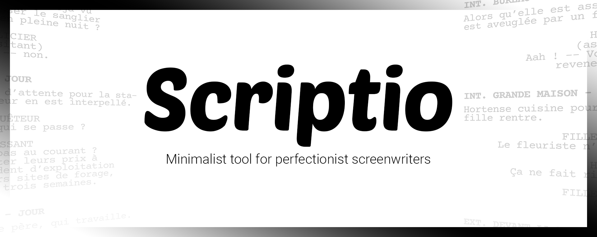

    

  Minimalist tool for perfectionist screenwriters

    
    

# Purpose

I like writing and creating stories in my spare time. For the last few years I have been using plenty of online screenplay editors such as _Celtx_, _WriterDuet_ or _KitScenarist_, each of these being more or less enjoyable. However, none of them met my criteria. I wanted a **free**, **dead simple**, but **pretty** screenplay editor.

My biggest inspiration is by far _Amazon Story Writer_, a very handy writing tool released by Amazon in 2015, which has unfortunately been shut down on June 30, 2019.

# Features

-   Online and offline mode (yet to come)
-   Export to PDF or .fountain format (more to come)
-   Dark theme
-   Screenplay statistics
-   Scene navigation
-   Character management

# Dependencies

### _Editor_

The choice of following dependencies were the result of a long research and software design process as I wanted to use the best tools available for each task. I knew changing one of them afterwards would be a pain, so I had to be sure of the intended usage. I'm always open for better alternatives if you have any, feel free to open an issue in that case so we can discuss about it.

| Name         | Usage                                              | Package                                                                                      |
| ------------ | -------------------------------------------------- | -------------------------------------------------------------------------------------------- |
| tiptap       | Text editor framework, used here for screenwriting |  |
| prisma       | Database ORM                                       |              |
| chart.js     | Displaying charts for statistics                   |          |
| iron-session | Signed and encrypted cookies for authentication    |  |
| tauri        | Allow converting frontend app to desktop           |              |

### _File export_

I spent quite some time figuring out the best library to generate PDF files that are not just huge rendered pictures. It was an absolutely necessary feature for me for the text to be selectable, as with any other text document. I finally found _pdfmake_, which allows to custom the document quite well but still needs some tricks to add text background color (as with scene headings).

| Name       | Usage                                             | Package                                                                                  |
| ---------- | ------------------------------------------------- | ---------------------------------------------------------------------------------------- |
| file-saver | Creating files when exporting non-PDF screenplays |  |
| pdfmake    | Generating PDF files when exporting screenplays   |        |

### _Email_

Sending emails programmatically is a pain. I had to use a lot of different tools to get the job done. I chose AWS (SES) "Simple Email Service" as third-party service to send account validation and password recovery emails.

| Name       | Usage                                              | Package                                                                                  |
| ---------- | -------------------------------------------------- | ---------------------------------------------------------------------------------------- |
| hogan.js   | Templating language for email generation           |      |
| inline-css | Used along with hogan.js for inlining CSS in email |  |
| nodemailer | Sending emails from NodeJS                         |  |

# How to launch

Development is currently done under NodeJS v16.13.1 and NPM v8.1.2, using NextJS. Running the app locally only requires the following steps.

1. `npm install`
2. `npm run dev`
3. `http://localhost:3000`
