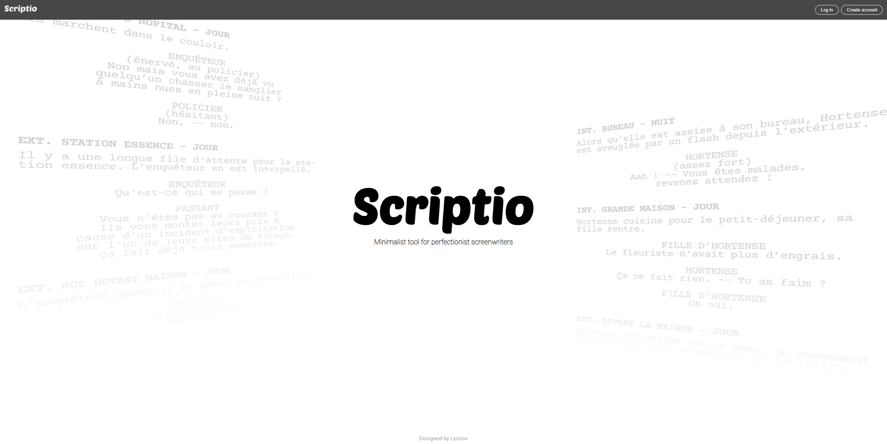

    

  Minimalist tool for perfectionist screenwriters

  

# Why Scriptio?
I like writing and creating stories in my spare time. For the last few years I have been using plenty of online screenplay editors, each of them being more or less enjoyable. I wanted a free, simple, but pretty screenplay editor, Scriptio was born.

My biggest inspiration is by far *Amazon Story Writer*, a very handy free tool published by Amazon, which has unfortunately been shut down on June 30, 2019.

# Features
- Online
- *planned* - Project management
- *planned* - Export to PDF or Fountain format
- *planned* - Collaborative editing
- *planned* - Screenplay sharing

# Dependencies
### Running
- Node `16.13.1`
- npm `8.1.2`

### Packages
- Animate.css `4.1.1`
- Tiptap `2.0.0`
- NuxtJS `3.0`

# How to launch
1. `npm install`
2. `npm run dev -- -o`