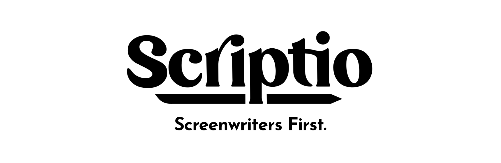

  

<h3 align="center">
Official repository for <i>Scriptio</i> screenwriting software
</h3>

  
    

Stop overpaying for Final Draft. Stop struggling with FadeIn clunky interface. Break free from Arc Studio, WriterSolo or Celtx free plan limits. Switch to the modern, elegant and affordable alternative.

# Introduction
Scriptio is built on three core values that set it apart. I carefully analyzed the strengths and weaknesses of current market solutions to craft a platform that combines the best of all worlds—delivering a complete and seamless writing experience.

While its only 'flaw' is being the new kid on the block, its ambition is clear: to become the essential, affordable alternative for professional screenwriters who refuse to compromise.

I am deeply committed to keeping Scriptio accessible. While infrastructure has a cost, I believe creators shouldn't have to bear that burden alone. I am currently exploring sustainable business models to ensure you never have to pay just to access essential features.

### Transparency
Nothing to hide. In an effort of building trust, Scriptio is source-available as opposed to most well-established screenwriting software

### Modernity
Cloud or offline. Browser or Desktop. Experience a fluid interface, customizable themes, and also real-time collaboration without friction

### Simplicity
Designed from the ground up to free your mind with intuitive workflow. We focus on getting the best out of existing screenwriting tools

# Features
- Real-time Collaboration
- Cloud Synchronization
- Export to PDF, Fountain and FDX formats (more to come)
- Screenplay Statistics
- Scene Navigation
- Character Management
- UI Themes
- Desktop App fully offline (to come)

# Disclaimer
*Scriptio is an independent project and is not affiliated with, sponsored by, or endorsed by Final Draft, Fade In, Arc Studio, WriterSolo, or Celtx. All product names, logos, and brands are property of their respective owners.*

  Copyright © 2026 Scriptio. All Rights Reserved.

